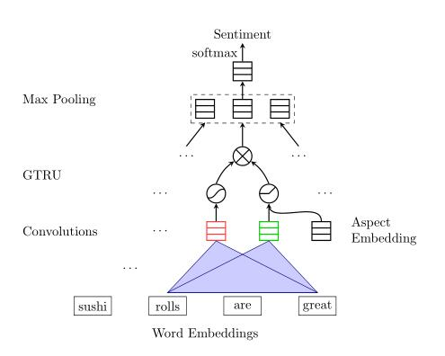
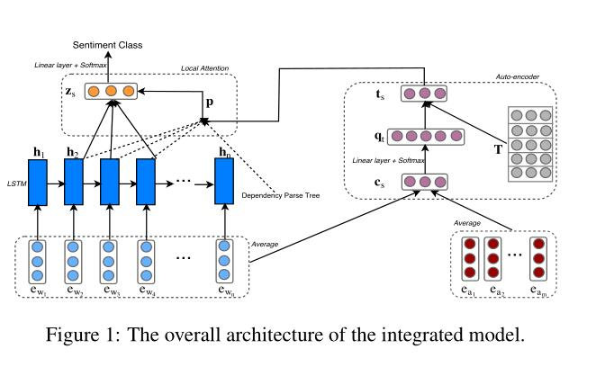

# AI Challenger 2018 细粒度用户评论情感分析
[比赛主页](https://challenger.ai/competition/fsauor2018)  
17th 解决方案，A榜 f1=0.71564，B榜 f1=0.71444，基于Aspect Level的思路，使用了两个模型。

## 运行

代码运行的TensorFlow版本为1.4.1，将比赛的用到的

* ai_challenger_fsauor2018_testa_20180816.zip
* ai_challenger_fsauor2018_validationset_20180816.zip
* ai_challenger_fsauor2018_trainingset_20180816.zip

这三个数据集放至 data/ 目录下，在根目录下运行以下命令即可：

`sh run.sh`

## 结构
* word2vec.py: 词向量、字向量生成
* feature.py: 生成SVD特征
* GCAE_word_char.py: 模型代码
* SynAtt_expand_model.py: 模型代码
* train.py: 训练入口
* utils.py: 一些公用的函数

## Aspect的选取
一开始选用的是数据说明里自带的“交通是否便利”、“距离商圈远近”……  
后来使用LightGBM跑了20个二分类的，根据特征重要性取TopK作为Aspect，得到如下结果：
```
subjects = ['地铁站 地铁 地理位置 位置 公交车 公交车站 公交站',
            '百货 商圈 商场 广场 购物中心 城 商业街',
            '容易 位置 醒目 找到 找 地理位置 显眼',
            '小时 排队 等 排 排号 队 号',
            '态度 服务员 热情 服务态度 老板 服务 服务生',
            '开车 停车费 停车位 停 停车场 车位 泊车',
            '很快 催 慢 速度 分钟 上菜 等',
            '小贵 不贵 价位 原价 块钱 价格 性价比',
            '不划算 物有所值 不值 物美价廉 超值 性价比 实惠',
            '活动 团 霸王餐 代金券 团购 优惠 券',
            '装修 布置 灯光 古色古香 装饰 优雅 情调',
            '安静 环境 装修 氛围 嘈杂 吵闹 音乐',
            '大 宽敞 空间 面积 装修 拥挤 店面',
            '整洁 干净 环境 卫生 苍蝇 不错 脏',
            '吃不完 一份 量 量足 个头 好大 少',
            '入味 吃 不错 味道 好吃 口味 好喝',
            '造型 颜色 精致 卖相 好看 色香味 食欲',
            '推荐 强烈推荐 值得 强推 一试 极力推荐 菜品',
            '好 满意 纪念品 内地 之 肠 灌',
            '还会 机会 再 不会 来 值得 推荐']
```

## 模型
### 字词向量联合表示
借鉴R-NET（R-NET:MACHINE READING COMPREHENSION WITH SELF-MATCHING NETWORKS）的方法，采用词向量和字向量联合表示。

```
例如：奶茶十分好喝

词向量表示：[W2V(奶茶),W2V(十分), W2V(好喝)]

经过BiRNN的字向量：[BiRNN(奶,茶),BiRNN(十,分), BiRNN (好,喝)]

最终向量表示：[Concat(W2V(奶茶), BiRNN(奶,茶)), Concat(W2V(十分), BiRNN(十,分)), Concat(W2V(好喝), BiRNN(好,喝))]
```


### GCAE
模型基于《Aspect Based Sentiment Analysis with Gated Convolutional Networks》的工作做改进。



改进：
* 字词向量联合表示
* 句子先经过一个单向的 LSTM 再做上图中操作
* 在最后的线性层之前加了 一个CNN
* 同时预测 20 个aspect

### SynATT
模型基于《Effective Attention Modeling for Aspect-Level Sentiment Classification》的工作做改进。



改进：
* 字词向量联合表示
* 在最后的线性层之前加了 一个CNN
* 同时预测 20 个aspect

### 融合
最终提交的结果是GCAE和SynATT分别跑了6折CV，加权融合。(B榜时没能及时跑完 T_T，所以成绩比A榜稍差一些)  
稍差的模型可能在某些aspect比稍好的模型分高，所以融合时以aspect粒度做融合，而不是直接将多个预测结果分别乘以一个权值相加。


如有错误，欢迎指正、讨论~
